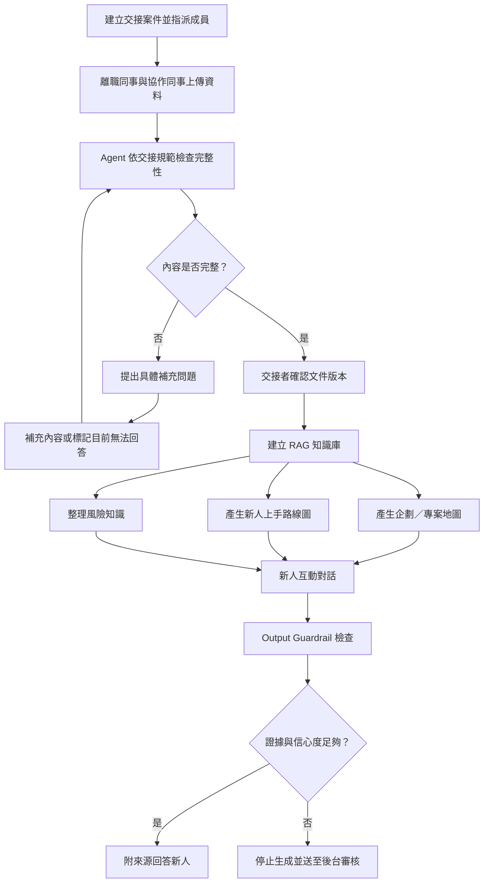
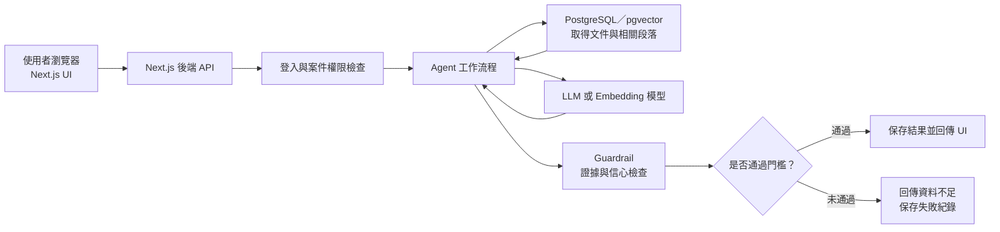

# Agent2 規格書

# 一、功能模組 (Functional Module)

|  |  |  |  |  |
| --- | --- | --- | --- | --- |
| 模組 | 編碼 | 功能簡述 | 檢驗指標 | 實作 輸入輸出 |
| 初始畫面 | FM01 | 登入畫面 UI |  |  |
|  |  | 登入註冊、身份確認 | (1) 使用者能註冊/登入信箱帳號。
(2) 確認身份為離職同事/同事或是新人。 |  |
| 離職同事引導 | FM02 | 資料上傳頁面 UI | (1) 提供能上傳交接資料的地方。 | 輸入：交接文件
輸出：—— |
|  |  | 產生交接清單 | (1) 根據不同模式，提供不同交接清單。 | 輸入：離職同事選擇的模式
輸出：不同模式相對應的清單 |
|  |  | 交接文件檔案收集 | (1) 離職同事能上傳交接資料的地方。 | 輸入：交接文件
輸出：—— |
|  |  | 離職同事引導頁面 UI | (1) 能列出缺乏 / 待改善文件清單。
(2) 離職同事能修正檔案，或選擇問題開放 / 待補並簡述原因。 | 輸入：交接文件 (來自先前的輸入)
輸出：缺乏 / 待改善文件清單 |
|  |  | 文件缺漏檢查 | (1) Agent 能讀取文件中有哪些缺漏 (文件應該有哪些欄位是我們事先定義好的)。 | 輸入：交接文件 (來自先前的輸入)
輸出：文件缺漏描述 |
|  |  | 經驗訪談 | (1) 能以問答的方式補充交接細節 | 輸入：離職同事對話
輸出：隱性知識與工作經驗 |
|  |  | 新人連動頁面 UI | (1) 離職同事能輸入自己的名字及職稱。
(2) 能顯示連動驗證碼。 | 輸入：離職同事的名字及職稱
輸出：連動驗證碼 |
|  |  | 產生連動驗證碼 | (1) 產生隨機驗證碼。
(2) 能成功在不同帳號連動。 | 輸入：——
輸出：連動驗證碼 |
| 新人功能導向頁 | FM03 | 問候與功能導向 UI | (1) 導向FM03~05 & 07。 |  |
| 企劃地圖 | FM04 | RAG 建置 | (1) 資料讀取與清洗。
(2) 文本切片。 (3) 向量化 (Embedding)。(4) 寫入向量資料庫。 | 輸入：交接文件 (來自先前的輸入) |
|  |  | 解析專案脈絡與心智圖呈現 UI | (2) 解析出 專案中的人員、專案/任務、決策/概念
(1) 畫出 人員、專案/任務、決策/概念之間的關係心智圖 | 輸入：(同上)
輸出：包含企劃脈絡的心智圖 |
| 新人上手路線圖 | FM05 | 新人上手路線圖頁面 UI | (1) 新人能查看任務清單、目前完成進度
(2) 能查看 Agent 建議 |  |
|  |  | 任務優先排序 | (1) 能動態調整任務優先序 | 輸入：交接文件 |
|  |  | 常見錯誤整理 | (1) 抽取出交接文件中的曾出過的錯誤、延期、特殊規則。 | 輸入：交接文件 (來自先前的輸入)
輸出：錯誤的名稱、詳述、參考來源 |
|  |  | 企劃相依關係提醒 | (1) 新人能查看部門之間的相依性 | 輸入：公司部門說明
輸出：部門之間的相依性 |
| 風險知識管理 | FM05 | 風險知識管理頁面 UI | (1) 抽取出交接文件中的曾出過的錯誤、延期、特殊規則。 (2) 新人能查看常見錯誤、詳細情況常見錯誤整理。 | 輸入：交接文件 (來自先前的輸入)
輸出：錯誤的名稱、詳述、參考來源 |
| 輔助互動對話 | FM06 | 頁面 UI - User | (1) 新人能查看企劃地圖、新人路線圖、風險管理之簡述(下拉選單)
(2) 顯示對話框、選擇對話 | 輸入：企劃地圖、新人路線 |
|  |  | 頁面 UI - Admin | (1) 具有使用者對話摘要 ( 去敏感化 ) | 輸入：新人對話歷史 輸出：不包含談話細節的脈絡與 Guardrail 報錯內容 |
|  |  | 工作相關問答 | (1) 串接內部 LLM 進行對話 |  |
|  |  | 前輩視角回覆 | (1) 預設回應語氣風格。
(2) 提供與離職同事會話紀錄 → 模擬前輩口穩與回應風格 |  |
|  |  | 任務執行引導 | (1) 能將代辦任務拆解成一步一步的操作流程 |  |
|  |  | Output Guardrail | (1) 略 | 輸入：未經審核
輸出：錯誤的名稱、詳述、參考來源 |

# 統一使用技術

| 技術 | 位於哪一層 | 在本系統的用途 | 具體例子 |
| --- | --- | --- | --- |
| TypeScript | 全部程式碼 | 統一前端、後端與 Agent 串接程式的語言 | 定義使用者角色、交接文件格式、Agent 輸出格式、信心分數 |
| Next.js 16 | Web app 前後端框架 | 製作畫面、處理登入、檔案上傳與 API | 登入頁、文件上傳頁、企劃地圖、待辦清單、對話介面 |
| React | Next.js 內的畫面技術 | 製作可互動的使用者介面 | 心智圖節點、滑鼠懸浮說明、Checklist、聊天視窗 |
| Node.js 24 LTS | 伺服器執行環境 | 執行 Next.js 後端及 Agent 串接程式 | 讀取文件、呼叫模型、查詢 RAG、計算信心分數 |
| PostgreSQL | 資料儲存層 | 保存結構化、可長期保留的系統資料 | 使用者、角色、交接案件、文件版本、對話紀錄、待辦狀態 |
| pgvector | PostgreSQL 擴充功能 | 保存文件向量並進行語意檢索 | 找出與「這項決策為什麼改變」最相關的文件段落 |
| 本地檔案資料夾 | 檔案儲存層 | MVP 保存使用者上傳的原始檔案 | PDF、Word、圖片或其他附件 |
| Agent 串接層 | Next.js 後端中的 TypeScript 模組 | 組合文件、RAG、提示詞、模型及 Guardrail | 文件缺漏檢查、地圖生成、風險分析、互動問答 |

# 建議API

前端可以透過這些後端入口操作：

| API 功能 | 用途 |
| --- | --- |
| `POST /api/login` | 登入測試公司帳號 |
| `POST /api/documents` | 上傳交接文件 |
| `POST /api/agent/review` | 執行文件缺漏檢查 |
| `POST /api/agent/answer-gap` | 保存使用者的補充回答 |
| `POST /api/rag/build` | 對確認完成的文件建立 RAG |
| `POST /api/agent/project-map` | 產生企劃地圖 |
| `POST /api/agent/roadmap` | 產生新人上手路線圖 |
| `POST /api/agent/risks` | 整理風險知識 |
| `POST /api/chat` | 新人互動問答 |
| `GET /api/jobs/:id` | 查看長時間 Agent 工作的進度 |